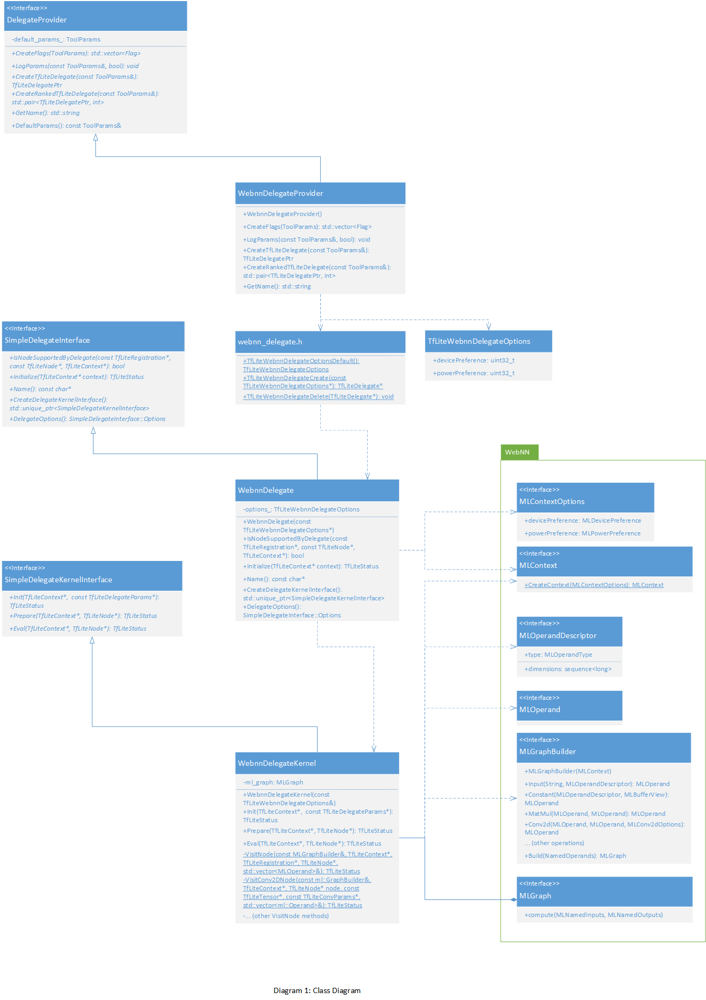

# WebNN Delegate for TensorFlow Lite WebAssembly runtime

| Status        | (Proposed)       |
:-------------- |:---------------------------------------------------- |
| **RFC #**     | [NNN](https://github.com/tfjs-sig/pull/NNN) (update when you have community PR #)|
| **Author(s)** | Ningxin Hu (ningxin.hu@intel.com), Chai Chaoweeraprasit (wchao@microsoft.com)  |
| **Sponsor**   | Ping Yu (piyu@google.com)                            |
| **Updated**   | 2021-10-20                                           |

## Objective

Implement a new [TensorFlow Lite Delegate](https://www.tensorflow.org/lite/performance/delegates) based on [Web Neural Network API](https://www.w3.org/TR/webnn/) (WebNN), a W3C specification for constructing and executing computational graphs of neural networks. This change would enable hardware acceleration of TensorFlow Lite WebAssembly runtime by leveraging on-device accelerators such as the GPU and DSP-based AI accelerators when running in Web browsers and JavaScript runtime (e.g. Node.js).

## Motivation

To answer [the key user needs](https://docs.google.com/presentation/d/14hbhzAduLCr_deYi6u6Z0otCSngf0lbvaHL_icfTXmY/edit#slide=id.gd4f136c3ce_0_3) of supporting more models and improving the performance, TensorFlow.js has integrated the TensorFlow Lite WebAssembly runtime and exposed it via [tfjs-tflite API](https://js.tensorflow.org/api_tflite/0.0.1-alpha.4/) and [Task API](https://js.tensorflow.org/api_tasks/0.0.1-alpha.8/).

However, the users of TensorFlow Lite WebAssembly runtime can only access [128-bit SIMD instructions](https://github.com/WebAssembly/simd) and [multi-threading](https://github.com/WebAssembly/threads) of CPU device via [XNNPACK delegate](https://github.com/huningxin/tensorflow/tree/webnn_delegate/tensorflow/lite/delegates/xnnpack). As a comparison, the users of TensorFlow Lite native runtime could access GPU acceleration via [GPU delegate](https://www.tensorflow.org/lite/performance/gpu) and other hardware accelerators via [NNAPI delegate](https://www.tensorflow.org/lite/performance/nnapi). The lack of access to platform capabilities beneficial for ML such as dedicated ML hardware accelerators constraints the scope of experiences and leads to inefficient implementations on modern hardware. This disadvantages the users of TensorFlow Lite WebAssembly runtime in comparison to the users of its native runtime.

According to the [data](https://www.w3.org/2020/06/machine-learning-workshop/talks/access_purpose_built_ml_hardware_with_web_neural_network_api.html#slide-4), when testing MobileNetV2 on a mainstream laptop, the native inference could be 9.7x faster than WebAssembly SIMD. If enabling WebAssembly multi-threading, the native inference is still about 4x faster. That's because the native inference could leverage the longer SIMD instructions (e.g. [AVX 256](https://en.wikipedia.org/wiki/Advanced_Vector_Extensions)) and corresponding optimized memory layout. The data also demostrates when native inference accesses the ML specialized hardware, such as [VNNI](https://en.wikichip.org/wiki/x86/avx512_vnni) instruction on laptop or DSP on smartphone, for the 8-bit quantized model inference, the performance gap would be even over 10x. This capability would not only speed up the inference performance but also help save the power consumption. For example, as the [slide](https://www.w3.org/2020/06/machine-learning-workshop/talks/accelerate_ml_inference_on_mobile_devices_with_android_nnapi.html#slide-8) illustrates, by leveraging DSP through NNAPI, the power reduction could be 3.7x.

The WebNN API is being standardized by W3C Web Machine Learning [Working Group](https://www.w3.org/groups/wg/webmachinelearning) (WebML WG) after two years incubation within W3C Web Machine Learning [Community Group](https://www.w3.org/groups/cg/webmachinelearning). In June 2021, W3C WebML WG published WebNN [First Public Working Draft](https://www.w3.org/2020/Process-20200915/#fpwd) and plans to release the [Candidate Recommendation](https://www.w3.org/2020/Process-20200915/#RecsCR) in Q2 2022. WebNN may be implemented in Web browsers by using the available native operating system machine learning APIs, such as Android/ChromeOS [Neural Networks API](https://developer.android.com/ndk/guides/neuralnetworks), Windows [DirectML API](https://docs.microsoft.com/en-us/windows/ai/directml/dml-intro) and macOS/iOS [ML Compute API](https://developer.apple.com/documentation/mlcompute/). This architecture allows JavaScript ML frameworks to tap into cutting-edge machine learning innovations in the operating system and the hardware platform underneath it without being tied to platform-specific capabilities, bridging the gap between software and hardware through a hardware-agnostic abstraction layer.

As a related work, [OpenCV.js](https://docs.opencv.org/3.4/d5/d10/tutorial_js_root.html) (the OpenCV WebAssembly runtime) has started implementing WebNN backend of dnn (deep neural networks) module. The [early result](https://github.com/opencv/opencv/pull/20406) showed 7x speedup for SqueezeNet compared to its optimized WebAssembly backend when running in Node.js/Electron.js runtime.

## User Benefit

A headline might be: "Accelerating the TensorFlow Lite WebAssembly runtime with WebNN API". 

1. Users will be able to enable hardware acceleration of TensorFlow Lite WebAssembly runtime by leveraging on-device accelerators, such as the GPU and DSP, across operating systems and devices. That will bring close-to-native performance and power reduction.
2. Users will be able to run 8-bit quantized model by TensorFlow Lite WebAssembly runtime with specialized hardware features, such as CPU VNNI instruction and Edge TPU.
3. Other contributors will be able to maintain one WebNN delegate implementation for various type of accelerators for TensorLow Lite WebAssembly runtime.

## Design Proposal

### Overview

We propose:
 1. A `WebnnDelegate` class that implements [`SimpleDelegateInterface`](https://github.com/tensorflow/tensorflow/blob/master/tensorflow/lite/delegates/utils/simple_delegate.h). This class represents the capabilities of the WebNN delegate, checks which operations are supported for the graph to be delegated and works as a factory class for creating a kernel (represented by `WebnnDelegateKernel`) that encapsulates the delegated graph.
 1. A `WebnnDelegateKernel` class that implements [`SimpleDelegateKernelInterface`](https://github.com/tensorflow/tensorflow/blob/master/tensorflow/lite/delegates/utils/simple_delegate.h). This class encapsulates the logic for building and invoking WebNN graph for the delegated graph.
 1. A `WebnnDelegateProvider` class that implements [`DelegateProvider`](https://github.com/tensorflow/tensorflow/blob/master/tensorflow/lite/tools/delegates/delegate_provider.h). This class works with TFLite delegate registrar and creates WebNN delegate instance based on the command-line flags for reusing TFLite tests and tooling.

The class diagram of the design proposal is shown in Diagram 1.

<div align="center">

</div>

### The extern "C" APIs for creating and deleting the WebNN delegate

`TfLiteWebnnDelegateOptionsDefault()`, `TfLiteWebnnDelegateCreate()` and `TfLiteWebnnDelegateDelete()` are extern "C" APIs for creating and deleting the WebNN delegate. They are defined in `webnn_delegate.h` header file.

`TfLiteWebnnDelegateOptions` is a structure that is used to supply options when creating a WebNN delegate. The options map to [`MLContextOptions`](https://www.w3.org/TR/webnn/#dictdef-mlcontextoptions) for device and power preferences.

It may be implemented as:
```c++
typedef struct {
  // This corresponds to the DevicePreference enum defined in the WebNN API, default 0.
  // enum class DevicePreference : uint32_t {
  //     Default = 0x00000000,
  //     Gpu = 0x00000001,
  //     Cpu = 0x00000002,
  // };
  uint32_t devicePreference;
  // This corresponds to the PowerPreference enum defined in the WebNN API, default 0.
  // enum class PowerPreference : uint32_t {
  //     Default = 0x00000000,
  //     High_performance = 0x00000001,
  //     Low_power = 0x00000002,
  // };
  uint32_t powerPreference;
} TfLiteWebnnDelegateOptions;
```

`TfLiteWebnnDelegateOptionsDefault()` is used to create a structure with the default WebNN delegate options.
```c++
TfLiteWebnnDelegateOptions TfLiteWebnnDelegateOptionsDefault();
```

```c++
TfLiteDelegate* TfLiteWebnnDelegateCreate(const TfLiteWebnnDelegateOptions* options);
```

`TfLiteWebnnDelegateCreate()` is the main entry point to create a new instance of WebNN delegate. It implements the following steps:
  1. Create a new instance of `WebnnDelegate` named _`webnn_delegate`_ with options of `TfLiteWebnnDelegateOptions`.
  1. Call [`tflite::TfLiteDelegateFactory::CreateSimpleDelegate()`](https://github.com/tensorflow/tensorflow/blob/master/tensorflow/lite/delegates/utils/simple_delegate.h#L113) with _`webnn_delegate`_ and returns the pointer to  [`TfLiteDelegate`](https://github.com/tensorflow/tensorflow/blob/master/tensorflow/lite/c/common.h).

`TfLiteWebnnDelegateDelete()` destroys a WebNN delegate created with `TfLiteWebnnDelegateCreate()` call.
```c++
void TfLiteWebnnDelegateDelete(TfLiteDelegate* delegate);
```

#### `WebnnDelegate` class

The `WebnnDelegate` class may be declared as following:

```c++
class WebnnDelegate : public SimpleDelegateInterface {
 public:
  explicit WebnnDelegate(const TfLiteWebnnDelegateOptions* params);

  TfLiteStatus Initialize(TfLiteContext* context) override;

  bool IsNodeSupportedByDelegate(const TfLiteRegistration* registration,
                                 const TfLiteNode* node,
                                 TfLiteContext* context) const override;

  std::unique_ptr<SimpleDelegateKernelInterface> CreateDelegateKernelInterface() override {
    return std::make_unique<WebnnDelegateKernel>(params_);
  }

  const char* Name() const override { return "TfLiteWebnnDelegate"; }

  SimpleDelegateInterface::Options DelegateOptions() const override {
    return SimpleDelegateInterface::Options();
  }

 private:
  TfLiteWebnnDelegateOptions params_;
};
```

As a client of `SimpleDelegateInterface`, `WebnnDelegate` implements the following methods:

Constructor: if `params` is not a `nullptr`, set `params_` to `params`. Otherwise, set `params_` to the default value returned by `TfLiteWebnnDelegateOptionsDefault()`

`Initialize`: this method is invoked before finding and replacing TfLite nodes with delegate kernels. The implementation checks whether WebNN API is available, e.g. by detecting [`createContext()`](https://www.w3.org/TR/webnn/#dom-ml-createcontext) method. If it is available, return `kTfLiteOk`. Otherwise, return `kTfLiteError`.

`IsNodeSupportedByDelegate`: returns true if `node` is supported by WebNN delegate. False otherwise. In particular, it identifies the type of operation by `TfLiteRegistration->builtin_code` and check following against corresponding WebNN operations:
  - The op version in `TfLiteRegistration->version`.
  - The data type of each input of `TfLiteNode->inputs`.
  - The parameters of each node in `TfLiteNode->builtin_data`, e.g. `TfLiteConvParams` for `kTfLiteBuiltinConv2d`.

`CreateDelegateKernelInterface`: create the instance of `WebnnDelegateKernel` that implements interface `SimpleDelegateKernelInterface`. An instance of `SimpleDelegateKernelInterface` represents one subgraph to be delegated.

`Name`: returns string "TfLiteWebnnDelegate". This name is used for debugging/logging/profiling.

`DelegateOptions`: WebNN doesn't specifies the maximum number of delegated subgraph and the minimum number of nodes allowed in a delegated graph. Returns the default value.

### `WebnnDelegateKernel` class

`WebnnDelegateKernel` class implements `SimpleDelegateKernelInterface`. It represents an abstraction of a WebNN graph of ([`MLGraph`](https://www.w3.org/TR/webnn/#api-mlgraph)) with functionality to build and invoke it based on the TFLite subgraph to be delegated.

`WebnnDelegateKernel` class may be declared as following:

```c++
class WebnnDelegateKernel : public SimpleDelegateKernelInterface {
 public:
  explicit WebnnDelegateKernel(const ::TfLiteWebnnDelegateOptions& params);
  ~WebnnDelegateKernel() override;

  TfLiteStatus Init(TfLiteContext* context,
                    const TfLiteDelegateParams* params) override;

  TfLiteStatus Prepare(TfLiteContext* context, TfLiteNode* node) override;

  TfLiteStatus Eval(TfLiteContext* context, TfLiteNode* node) override;

 private:
  static TfLiteStatus VisitNode(
      const MLGraphBuilder& builder, TfLiteContext* context,
      TfLiteRegistration* registration, TfLiteNode* node,
      std::vector<MLOperand>& webnn_operands);
  
  static TfLiteStatus VisitConv2DNode(
      const ml::GraphBuilder& builder, TfLiteContext* context,
      TfLiteNode* node, const TfLiteTensor* tensors,
      const TfLiteConvParams* conv_params,
      std::vector<ml::Operand>& webnn_operands);

  // ...
  // Other VisitNode methods

  ::TfLiteWebnnDelegateOptions params_;

  MLGraph webnn_graph_;
};
```

`Init`: builds the WebNN graph and add required nodes. It implements following steps:

 1. Create WebNN context of [`MLContext`](https://www.w3.org/TR/webnn/#api-mlcontext) and graph builder of [`MLGraphBuilder`](https://www.w3.org/TR/webnn/#api-mlgraphbuilder).
 1. Create a vector of WebNN operands _`webnn_operands`_ of type [`MLOperand`](https://www.w3.org/TR/webnn/#api-mloperand) with size of `TfLiteContext->tensor_size`. This vector is used to map TFLite tensor to WebNN operands by TFLite tensor index.
 1. Get the input tensors by accessing `TfLiteDelegateParams->input_tensors`. For each input tensor, execute the following steps:
    1. Check whether the tensor data is already allocated for this input tensor.
    1. If the data is allocated, then create a WebNN constant operand by following steps:
        1. Create a _`desc`_ of [`MLOperandDescriptor`](https://www.w3.org/TR/webnn/#api-mloperanddescriptor) based on the tensor's data type (`TfLiteTensor->type`) and shape (`TfLiteTensor->dims`).
        1. Create a _`buffer_view`_ of [`MLArrayBufferView`](https://www.w3.org/TR/webnn/#typedefdef-mlbufferview) based on the tensor's data (`TfLiteTensor->data->raw_const`) and byte length (`TfLiteTensor->bytes`).
        1. Call [`MLGraphBuilder.constant`](https://www.w3.org/TR/webnn/#dom-mlgraphbuilder-constant) with  _`desc`_ and _`buffer_view`_.
    1. Otherwise create a WebNN input operand by executing following steps:
        1. Create a _`desc`_ of [`MLOperandDescriptor`](https://www.w3.org/TR/webnn/#api-mloperanddescriptor) based on the tensor's data type (`TfLiteTensor->type`) and shape (`TfLiteTensor->dims`).
        1. Create a _`name`_ of string based on the tensor index.
        1. Call [`MLGraphBuilder.input`](https://www.w3.org/TR/webnn/#dom-mlgraphbuilder-input) with _`name`_ and _`desc`_.
    1. For above both cases, insert the newly created operand into _`webnn_operands`_ indexed by the tensor index.
 1. Get the nodes to be replaced by accessing `TfLiteDelegateParams->nodes_to_replace`. For each node, execute the following steps:
    1. Retrieve its `TfLiteNode` and `TfLiteRegistration`.
    1. Call `WebnnDelegateKernel::VisitNode` with the `TfLiteContext`, `TfLiteNode` and `TfLiteRegistration` together with WebNN `MLGraphBuilder` and _`webnn_operands`_. It builds the actual WebNN operation according to the TFLite node. After it returns, the output operand of that WebNN operation is put into _`webnn_operands`_. Please see details of `WebnnDelegateKernel::VisitNode` in the following section.
 1. Get the TFLite output tensors by accessing `TfLiteDelegateParams->output_tensors`. Build the _`webnn_named_operands`_ of [`MLNamedOperands`](https://www.w3.org/TR/webnn/#typedefdef-mlnamedoperands) by iterating the TFLite output tensors and executing following steps for each output tensor:
    1. Find the WebNN operand in _`webnn_operands`_ by the output tensor index.
    1. Insert the WebNN operand into _`webnn_named_operands`_ and associate it with the output tensor index as the name.
 1. Build a new instance of WebNN [`MLGraph`](https://www.w3.org/TR/webnn/#api-mlgraph) by calling [`MLGraphBuilder.build`](https://www.w3.org/TR/webnn/#dom-mlgraphbuilder-build) with _`named_operands`_. And set _`webnn_graph_`_ to this new instance.

 `Prepare`: as the WebNN `MLGraph` is built by `Init`, it is implemented as a null operation.

`Eval` does the actual inference of the delegated subgraph by computing the `MLGraph` with inputs and outputs of the `TfLiteNode`. It basically executes the following steps:
 1. Create _`webnn_named_inputs`_ of [`MLNamedInputs`](https://www.w3.org/TR/webnn/#typedefdef-mlnamedinputs).
 1. For each input tensor of `TfLiteNode->inputs`, execute the following steps:
    1. Create _`buffer_view`_ of `MLArrayBufferView` based on the input tensor's data (`TfLiteTensor->data->raw_const`) and byte length (`TfLiteTensor->bytes`).
    1. Create _`name`_ of string based on the input tensor index.
    1. Associate _`buffer_view`_ with _`name`_ and insert it into _`webnn_named_inputs`_.
 1. Create _`webnn_named_outputs`_ of [`MLNamedOutputs`](https://www.w3.org/TR/webnn/#typedefdef-mlnamedoutputs).
 1. For each output tensor of `TfLiteNode->outputs`, execute the following steps:
    1. Create _`buffer_view`_ of `MLArrayBufferView` based on the output tensor's data (`TfLiteTensor->data->raw_const`) and byte length (`TfLiteTensor->bytes`).
    1. Create _`name`_ of string based on the output tensor index.
    1. Associate _`buffer_view`_ with _`name`_ and insert it into _`webnn_named_outputs`_.
 1. Call [`MLGraph.compute()`](https://www.w3.org/TR/webnn/#dom-mlgraph-compute) with _`webnn_named_inputs`_ and  _`webnn_named_outputs`_. After this call completes, the results are put into the TFLite output tensors' buffer.

`VisitNode` builds a WebNN operation with `MLGraphBuilder` based on TFLite node represented by `TfLiteRegistration` and `TfLiteNode`. It basically executes the following steps:
 1. Check the type of TFLite node by accessing `TfLiteRegistration->builtin_code`.
 1. Based on the `builtin_code`, such as `kTfLiteBuiltinConv2d`, get the parameters from `TfLiteNode->builtin_data`, e.g. `TfLiteConvParams`, call corresponding WebNN operation building method, such as `VisitConv2DNode`.

A TFLite node might be decomposed to multiple smaller WebNN operations. The following code illustrates the kernel of TensorFlow Lite `kTfLiteBuiltinConv2d` may be implemented with WebNN operations `conv2d`, `add` and `relu`:

```c++
static TfLiteStatus VisitConv2DNode(
    const ml::GraphBuilder& builder, TfLiteContext* context,
    TfLiteNode* node, const TfLiteTensor* tensors,
    const TfLiteConvParams* conv_params,
    std::vector<ml::Operand>& webnn_operands) {
  ml::AutoPad auto_pad;
  // Translate TFLite padding to WebNN
  // e.g. ml::AutoPad::SameUpper for kTfLitePaddingSame
  TF_LITE_ENSURE_STATUS(CalculatePadding(
      context, conv_params->padding, auto_pad));

  ml::Conv2dOptions options;
  options.autoPad = auto_pad;
  std::vector<int32_t> strides = {
      conv_params->stride_height, conv_params->stride_width};
  options.strides = strides.data();
  options.stridesCount = strides.size();
  std::vector<int32_t> dilations = {
      conv_params->dilation_height_factor, conv_params->dilation_width_factor};
  options.dilations = dilations.data();
  options.dilationsCount = dilations.size();
  options.inputLayout = ml::InputOperandLayout::Nhwc;
  options.filterLayout = ml::FilterOperandLayout::Ohwi;
  // Build conv2d
  const int input_tensor_index = node->inputs->data[0];
  const int filter_tensor_index = node->inputs->data[1];
  ml::Operand output =
      builder.Conv2d(webnn_operands[input_tensor_index], 
                     webnn_operands[filter_tensor_index],
                     &options);
  const int bias_tensor_index = node->inputs->data[2];
  // bias_tensor_id < 0 means without bias.
  if (bias_tensor_id >= 0) {
    // Add bias
    output = builder.Add(output, webnn_operands[bias_tensor_id]);
  }
  const int output_tensor_index = node->outputs->data[0];
  webnn_operands[output_tensor_index] = output;

  // Build WebNN ops regarding to activation type,
  // e.g. relu for kTfLiteActRelu and clamp for kTfLiteActRelu6 etc.,
  TF_LITE_ENSURE_STATUS(VisitActivation(
        builder, context, output_tensor_index, output_tensor_index,
        conv_params->activation, webnn_operands));

  return kTfLiteOk;
}
```

### `WebnnDelegateProvider` class

`WebnnDelegateProvider` may be declared as following:

```c++
class WebnnDelegateProvider : public DelegateProvider {
 public:
  WebnnDelegateProvider();

  std::vector<Flag> CreateFlags(ToolParams* params) const final;

  void LogParams(const ToolParams& params, bool verbose) const final;

  TfLiteDelegatePtr CreateTfLiteDelegate(const ToolParams& params) const final;
  std::pair<TfLiteDelegatePtr, int> CreateRankedTfLiteDelegate(
      const ToolParams& params) const final;

  std::string GetName() const final { return "WebNN"; }
};
```

As a client of `DelegateProvider`, `WebnnDelegateProvider` implements the following methods:

`CreateFlags` creates a list of command-line parsable flags based on tool params inside `params` whose value will be set to the corresponding runtime flag value. Please see details of the tool flags of WebNN in the following table:

| Name | Type | Usage | Default value |
|---|---|---|---|
| use_webnn | bool | Use WebNN delegate | false |
| webnn_device_preference | uint32_t | WebNN device preference (0:default, 1:gpu, 2:cpu) | 0 |
| webnn_power_preference | uint32_t | WebNN power preference (0:default, 1:high-performance, 2:low-power) | 0 |

`LogParams` logs tool params via `LOG_TOOL_PARAM`.

`CreateTfLiteDelegate` translates the tool params to `TfLiteWebnnDelegateOptions` and creates a WebnnDelegate based on that options.

`CreateRankedTfLiteDelegate` same as `CreateTfLiteDelegate`.

`GetName` returns "WebNN".

### Alternatives Considered

To access GPU, one alternative solution would be implementing a WebGL/WebGPU delegate. TensorFlow.js already uses WebGL and are working on a WebGPU backend. We believe this alternative is insufficient for two reasons. First, although graphics abstraction layers provide the flexibility of general programmability of the GPU graphics pipelines, they are unable to tap into hardware-specific optimizations and special instructions that are available to the operating system internals. The hardware ecosystem has been investing significantly in innovating in the ML space, and much of that is about improving the performance of intensive compute workloads in machine learning scenarios. Some key technologies that are important to model performance may not be uniformly accessible to applications through generic graphics pipeline states. Secondly, there are other accelerators, such as DSP-based AI accelerators and Edge TPU, that are not exposed through WebGL and WebGPU API. A WebGL/WebGPU delegate would not be able to enable the hardware accelerations on those accelerators.

Actually, the WebNN delegate is also able to run on top of [WebNN-polyfill](https://github.com/webmachinelearning/webnn-polyfill), a JavaScript implementation of WebNN API based on TensorFlow.js kernels. Through this path, TensorFlow Lite WebAssembly runtime could leverage the WebGL/WebGPU implementation of TensorFlow.js ops instead of implementing a WebGL/WebGPU delegate.

### Performance Implications

There will be no performance implications for users of TensorFlow Lite WebAssembly runtime if they won't enable WebNN delegate, because the model will still be executed by XNNPACK delegate and built-in operation kernels. If users enable WebNN delegate, TensorFlow Lite runtime would partition the graph based on the operations supported by WebNN delegate. Each partition that is handled by WebNN delegate will be replaced by a WebNN delegate node in the original graph that evaluates the partition on its invoke call. Depending on the model, the final graph can end up with one or more nodes, the latter meaning that some ops are not supported by WebNN delegate. If the whole model could be handled by WebNN delegate, the performance characteristics would depend on the native operating system API and the type of hardware device that are used by the WebNN implementation of the Web browsers or JavaScript runtime. If there are multiple nodes in the final graph, there is an overhead for passing the results from the delegated subgraph to the main graph that results due to memory copies (for example, GPU to CPU) and layout conversions (e.g. plain layout to blocked layout). Such overhead might offset performance gains especially when there are a large amount of memory copies. WebNN API allows to specify the [device preference](https://www.w3.org/TR/webnn/#enumdef-mldevicepreference) when creating the `MLContext` for neural network graph compilation and compute. Users could keep using the same device (e.g. CPU) of WebNN delegate with other executors (e.g. XNNPACK delegate) that avoids unnecessary memory copies across devices.

The implementation of WebNN delegate will follow the [TensorFlow Lite delegate development guide](https://www.tensorflow.org/lite/performance/implementing_delegate). So the TensorFlow Lite [Model Benchmark Tool](https://github.com/tensorflow/tensorflow/tree/f9ef3a8a0b64ad6393785f3259e9a24af09c84ad/tensorflow/lite/tools/benchmark), [Inference Diff tool](https://github.com/tensorflow/tensorflow/tree/f9ef3a8a0b64ad6393785f3259e9a24af09c84ad/tensorflow/lite/tools/evaluation/tasks/inference_diff) and [task specific evaluation tools](https://www.tensorflow.org/lite/performance/delegates#task-based_evaluation) could be used to test and benchmark. The [TensorFlow.js Model Benchmark](https://github.com/tensorflow/tfjs/tree/master/e2e/benchmarks/local-benchmark) could be used to benchmark WebNN delegate once it supports TensorFlow Lite WebAssembly runtime.

### Dependencies

The TensorFlow Lite WebNN delegate takes a dependency on the WebNN API and implementations. The WebNN API is being standardized by W3C Web Machine Learning Working Group. The WebNN API implementations include:
* [WebNN-polyfill](https://github.com/webmachinelearning/webnn-polyfill): a JavaScript implementation based on TensorFlow.js kernels. It could run where TensorFlow.js could run and depends on JavaScript, WebAssembly, WebGL and WebGPU that TensorFlow.js uses. This project is maintained by W3C Web Machine Learning Community Group.
* [WebNN-native](https://github.com/webmachinelearning/webnn-native): a C++ implementation based on native ML API. It provides WebNN C/C++ headers (`webnn.h` and `webnn_cpp.h`) for C++ code to use. TensorFlow Lite WebNN delegate implementation will use these interfaces. The backend implementation of WebNN-native uses native ML API, including [DirectML](https://docs.microsoft.com/en-us/windows/ai/directml/dml-intro) on Windows and [OpenVINO](https://docs.openvinotoolkit.org/latest/index.html) on Linux/Windows. More backend implementations, such as [NNAPI](https://developer.android.com/ndk/guides/neuralnetworks), are to be added. This project is maintained by W3C Web Machine Learning Community Group.
* [WebNN-native binding for Node.js](https://github.com/webmachinelearning/webnn-native/tree/main/node): a Node.js [C++ addon](https://nodejs.org/api/addons.html) that is based on WebNN-native and exposes JavaScript API. It allows JavaScript/WebAssembly apps and frameworks, such as TensorFlow.js and TensorFlow Lite WebAssembly runtime, to access WebNN native implementation when running in Node.js and Electron.js. This project is maintained by W3C Web Machine Learning Community Group.
* [Emscripten](https://emscripten.org/): the compiler that compiles C++ code to WebAssembly. The implementation of WebNN support will be submitted and maintained by authors of this RFC.
* WebNN implementation in Web browsers, such as Chrome browser of ChromeOS. The implementation would be maintained by individual browser vendor.

### Engineering Impact

The WebNN delegate build will be produced with a newly added Bazel BUILD rule (e.g. cc_library with name `webnn_delegate`). The build will compile WebNN delegate sources (e.g. `webnn_delegate.h` and `webnn_delegate.cc`). According to the current implementation of 10 ops, the compilation time is about a few seconds. And the size of WebAssembly binary is increased by about 20KB. With more ops are implemented, the binary size is expected to be increased by another dozen of KB.

As a proposal, the code would be maintained by TensorFlow.js Special Interest Group (SIG).

### Platforms and Environments

The WebNN delegate works on all platforms supported by TensorFlow Lite WebAssembly runtime that include:
* Web browsers without WebNN API implemented: it is supported by WebNN-polyfill
* Web browsers with WebNN API implemented: it is supported by the native WebNN implementation of the browser
* Node.js/Electron.js: it is supported by the WebNN-native binding for Node.js

### Best Practices

This change will follow the [TensorFlow Lite delegate development guide](https://www.tensorflow.org/lite/performance/implementing_delegate) and won't change any best practices. 

### Tutorials and Examples

The C++ example that enables WebNN delegate.
```c++
// Available options.
struct TFLiteWebModelRunnerOptions {
  // Set the number of threads available to the interpreter.
  // -1 means to let interpreter set the threads count available to itself.
  int num_threads = kDefaultNumThreads;

  // Enable WebNN delegate or not.
  bool enable_webnn_delegate = false;

  // Device preference of WebNN delegate: 0 - default, 1 - gpu, 2 - cpu.
  int webnn_device_preference = 0;

  // Power preference of WebNN delegate: 0 - default, 1 - high-performance, 2 - low-power
  int webnn_power_preference = 0;
};

TfLiteStatus TFLiteWebModelRunner::InitFromBuffer(
    const char* model_buffer_data, size_t model_buffer_size,
    std::unique_ptr<tflite::OpResolver> resolver) {
  // Initilaize the model from flatbuffer.
  const char* model_buffer = reinterpret_cast<const char*>(model_buffer_data);
  flatbuffers::Verifier verifier(reinterpret_cast<const uint8_t*>(model_buffer),
                                 model_buffer_size);
  if (!tflite::VerifyModelBuffer(verifier)) {
    return kTfLiteError;
  }
  model_ =
      tflite::FlatBufferModel::BuildFromBuffer(model_buffer, model_buffer_size);

  // Initialize the interpreter from the model.
  const auto interpreter_builder_result =
      tflite::InterpreterBuilder(model_->GetModel(), *resolver, nullptr)(
          &interpreter_, options_.num_threads);
  if (interpreter_builder_result != kTfLiteOk) {
    return interpreter_builder_result;
  }
  if (!model_->initialized()) {
    return kTfLiteError;
  }

  // Enable WebNN delegate if requested.
  if (options_.enable_webnn_delegate) {
    TfLiteWebnnDelegateOptions options =
        TfLiteWebnnDelegateOptionsDefault();
    options.devicePreference = options_.webnn_device_preference;
    options.powerPreference = options_.webnn_power_preference;
    auto webnn_delegate = TfLiteWebnnDelegateCreate(&options);
    auto delegate_ptr = tflite::Interpreter::TfLiteDelegatePtr(webnn_delegate, [](TfLiteDelegate* delegate) {
      TfLiteWebnnDelegateDelete(delegate);
    });
    if (interpreter_->ModifyGraphWithDelegate(std::move(delegate_ptr)) != kTfLiteOk) {
        printf("Failed to apply webnn delegate.\n");
    }
  }

  // Allocate memory for the tensors in the model.
  return interpreter_->AllocateTensors();
}
```

The JavaScript example that uses WebNN delegate.
```javascript
// Load the MobilenetV2 tflite model from tfhub.
const tfliteModel = tflite.loadTFLiteModel(
     'https://tfhub.dev/tensorflow/lite-model/mobilenet_v2_1.0_224/1/metadata/1',
     {
       enableWebnnDelegate: true,
       webnnDelegateOptions: {devicePreference: 'gpu', powerPreference: 'low-power'}
     });

const outputTensor = tf.tidy(() => {
    // Get pixels data from an image.
    const img = tf.browser.fromPixels(document.querySelector('img'));
    // Normalize (might also do resize here if necessary).
    const input = tf.sub(tf.div(tf.expandDims(img), 127.5), 1);
    // Run the inference.
    let outputTensor = tfliteModel.predict(input) as tf.Tensor;
    // De-normalize the result.
    return tf.mul(tf.add(outputTensor, 1), 127.5)
  });
console.log(outputTensor);

```

### Compatibility

The change in this proposal concerns the low-level constructs inside the TensorFlow Lite WebAssembly runtime with minimal to no impact to the high-level exposures and API. The existing models supported by TensorFlow Lite WebAssembly runtime will be supported with WebNN delegate enabled.

### User Impact

This feature will be rolled out with the tfjs-tflite. There are two ways:

Via NPM
```js
// Import @tensorflow/tfjs-tflite.
import * as tflite from '@tensorflow/tfjs-tflite';
```

Via a script tag
```js
<script src="https://cdn.jsdelivr.net/npm/@tensorflow/tfjs-tflite/dist/tf-tflite.min.js"></script>
```

## Questions and Discussion Topics

* What's the path to support GPU buffers by TensorFlow Lite WebAssembly runtime? The use case is to interact with WebGL/WebGPU based pre and post-processing code. WebNN API supports taking WebGL and WebGPU textures/buffers as inputs and outputs.
* What's the path to integrate this change into MediaPipe Web solution.
