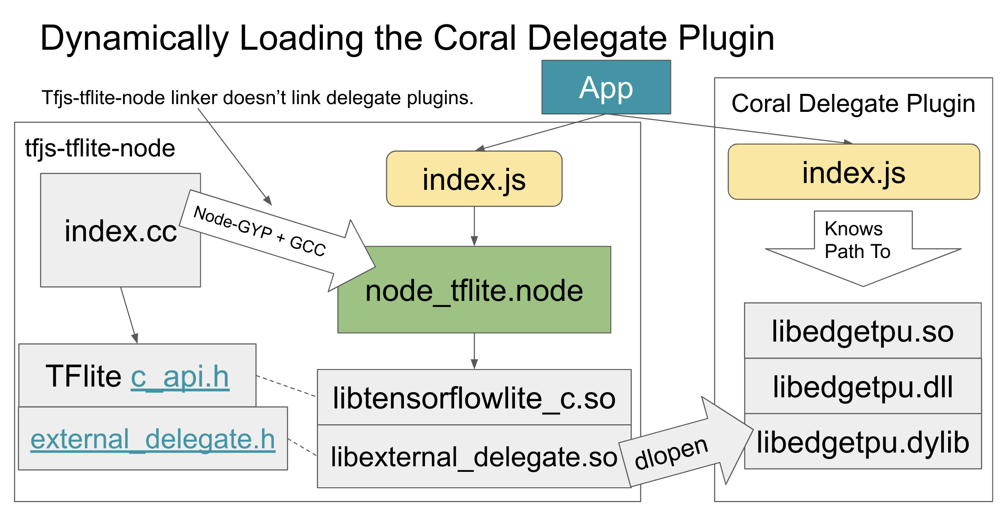
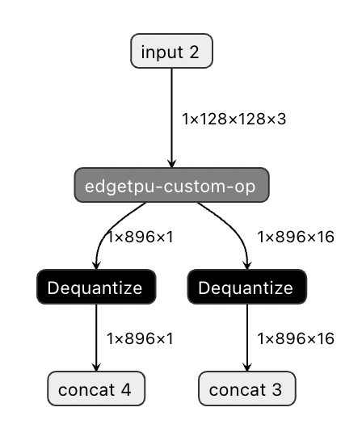
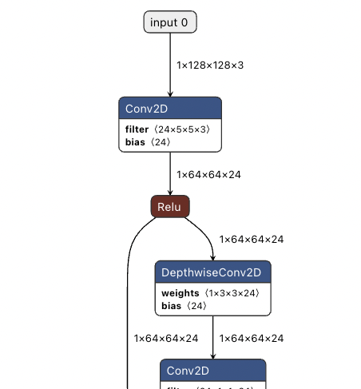

# TFLite Support for TFJS Node

| Status        | Proposed       |
:-------------- |:---------------------------------------------------- |
| **RFC #**     | [NNN](https://github.com/tfjs-sig/pull/NNN) (update when you have community PR #)|
| **Author(s)** | Matthew Soulanille (msoulanille@google.com), Jason Mayes (jmayes@google.com) |
| **Sponsor**   | Ping Yu (piyu@google.com)                 |
| **Updated**   | 2021-12-03                                          |


## Objective

Enable TensorFlow.js to run TFLite models in Node and support accelerating those models with delegates like the Coral accelerator. Separate delegates from TensorFlow.js's npm packages and support loading delegates in a standardized manner on the web and in Node.

Currently, TensorFlow.js supports running TFLite models on the web through WASM bindings. These bindings do not work in Node. Even if they did, they would not support PCIe Coral devices (and other PCIe delegates). With this proposal, we introduce a new tfjs-tflite-node package that exposes native TFLite bindings to Node. We also propose a standardized package format for delegates that enables dynamically loading them in Node and in the browser.

Currently the Coral device is available in multiple form factors:

1. As a [standalone USB dongle](https://coral.ai/products/accelerator/) that can be plugged into an edge device such as a Raspberry Pi. This will be the primary device form factor to support.
2. Directly integrated onboard with the developer kit such as the [Tinker Edge T](https://tinker-board.asus.com/product/tinker-edge-t.html).
3. Via PCIe interface such as [this offering from Asus](https://iot.asus.com/products/AI-accelerator/AI-Accelerator-PCIe-Card/).

If the Linux driver (libedgetpu.so) provides access to all form factors, then an interface to this driver from Node should be provided via TensorFlow.js APIs such that the user can specify the correct interface and send arbitary TFLite models to the Coral accelerator for ML inference.

As TensorFlow.js models in the model.json format can not be executed on the Coral accelerators directly, we will only support the loading of TFLite models via our API to be deployed to Coral accelerators. Conversion of TensorFlow.js models to this format required by the Coral device is outside of scope of this proposal but could be investigated if large enough demand in the future.


## Motivation

The TensorFlow.js team has received a number of requests (~20% of responses in our developer survey) that mentioned a desire for Coral support on edge devices such as the Raspberry Pi to acheive faster inference speeds when working with TensorFlow.js on such devices. In fact, for some users, not having Coral support was the main reason they could not work with TensorFlow.js as only Python bindings were available. There are a number of users making custom physical experiences that can benefit from such acceleration while still using the tech stacks they love, such as this user's feedback:

"It would be wonderful to have Coral support for TFJS so it's not a 2nd class citizen - It's a bit of a deal-breaker for some of our projects, and recently we purchased about 800+ ARM devices with GPU's for a IoT project when we would have rather used something such as the Coral dev board, however Node support is important as most of our IoT stack is in docker containers managed via Balena.io"

[After further investingation](https://github.com/tensorflow/tfjs/issues/1422#issuecomment-949049456), supporting Coral accelerators via WebUSB in the browser is currently not feasible due to OS level constraints around USB refresh after uploading firmware to the device each time it is plugged in. Currently this is best handled via a program that can interface with drivers at the OS Level such as Node.js vs the web browser itself. 

Furthrmore after speaking with potential users of such a system, the primary use case is to accelerate edge devices like the Raspberry Pi or Asus Tinker Edge T, as most laptops/desktops or current generation smart phones that execute TensorFlow.js in browser already have real time performance with many of our models and users are satisfied with performance on these higher end devices.

## User Benefit

By supporting TFLite and the Coral delegate for edge devices in Node, this will address:

1. User needs for high performance inference, on low power devices such as Raspberry PIs.
2. Enabling users to use the tech stacks they love or already use - namely Node.js - for which [over 50% of developers use as their framework of choice](https://insights.stackoverflow.com/survey/2020#technology-other-frameworks-libraries-and-tools-professional-developers3). 
3. Allowing users to stick within the TensorFlow.js ecocystem across the stack.
4. TFLite users who will be able to deploy their models via TensorFlow.js in Node instead of Python giving users a wider array of options for deployment based on their team's skills and preferences. 

Furthermore the [JIT compiler of JavaScript has proven to be faster than Python for ML usecases](https://blog.tensorflow.org/2020/05/how-hugging-face-achieved-2x-performance-boost-question-answering.html) for pre/post processing acceleration. Given the low powered nature of these edge devices, using a language that can run faster for this part of the ML pipeline outside of the inference itself, could be the difference between runing in realtime vs not on such a device.

A headline for a blog post about this proposal could be __Running TFLite Models in Node with Coral Acceleration__

## Design Proposal

### Overview
We propose:
1. To write a new package, `tfjs-tflite-node`, that implements the `TFLiteWebModelRunner` interface used by `tfjs-tflite` and supports running tflite models in node.
2. To provide a plugin system for [TFLite Delegates](https://www.tensorflow.org/lite/performance/delegates) and a Coral plugin that provides support for Coral accelerators.

We exclude from the scope of this proposal:
1. Coral support for web - This is of limited use for Coral devices, [which must be plugged in, unplugged, and plugged in again to work on the web](https://github.com/google-coral/webcoral#device-setup).

### High Level Constraints and Tradeoffs
1. Package size - Constrained more than usual for an npm package since a target platform is IoT devices.
2. Supported platforms vs Maintainability - TFLite does not ship precompiled binaries, and [Coral ships a limited set of precompiled binaries](https://github.com/google-coral/libedgetpu/releases/tag/release-grouper). We need to balance supported platforms with maintenance cost to the team. Ideally, we would let users compile TFLite and libedgetpu themselves for unsupported platforms.
3. Where to implement the proposal - In tfjs-node? In tfjs-tflite? In a new package? See the discussion section at the bottom for details on this.
4. Whether to use the [TFLite C api](https://github.com/tensorflow/tensorflow/blob/master/tensorflow/lite/c/c_api.h) or the [C++ api](https://github.com/tensorflow/tensorflow/blob/master/tensorflow/lite/BUILD#L343-L370). The [demo](#proof-of-concept-demo-repository) uses the C api, but tfjs-tflite uses the C++ api. The APIs are nearly functionally equivalent. The C library is 2.9MB while the C++ library is 3.4MB.

### Running TFLite Models in Node
TFLite provides a C API and a C++ API for running models. The [C API aims to be more simple than the C++ API](https://github.com/tensorflow/tensorflow/blob/master/tensorflow/lite/c/c_api.h#L27-L31), and this is what the demo uses. The C++ API is what `tfjs-tflite` currently uses. As much as possible, we would like to provide the same interface for tflite in Node and on the web, so using the C++ API, while not strictly necessary, will likely make this easier. That being said, the C++ API requires that we copy all of TFLite's header files, along with abseil and flatbuffer headers, while the C api only requires three headers.

Unlike the WASM bundle, which is distributed as a precompiled binary, support for Node will be provided by Napi bindings to a precompiled tflite library. These Napi bindings will be compiled by node-gyp when installing the `tfjs-tflite-package`.

We will try to make these bindings as similar as possible to the WASM bindings we use in `tfjs-tflite`, and we may be able to reuse some code from `tfjs-tflite`, but this will require more investigation. The degree of success we have with this should not affect our ability to match `tfjs-tflite`'s API.

### Plugin System for Delegates
Coral and other accelerator delegates will be supported by plugins separately from the main tflite package, likely in separate npm packages. At runtime, the main tflite library will [dynamically load](https://en.wikipedia.org/wiki/Dynamic_loading#Uses) plugins specified by the user. Each of these plugins implements the TFLiteDelegatePlugin interface defined below. This approach, as opposed to a monolithic tflite entrypoint that includes all the accelerators / delegates, will allow us (and external contributors) to grow the list of supported delegates without impacting library size or requiring review from the TFJS team. This is similar to how delegates are loaded in Python, which is done via the [`tf.lite.experimental.load_delegate`](https://www.tensorflow.org/lite/api_docs/python/tf/lite/experimental/load_delegate) function. This function is [used in the PyCoral library](https://github.com/google-coral/pycoral/blob/master/pycoral/utils/edgetpu.py#L52) to load the Coral accelerator as a delegate, and it uses [`ctypes.pydll.LoadLibrary`](https://github.com/tensorflow/tensorflow/blob/v2.7.0/tensorflow/lite/python/interpreter.py#L90) under the hood. Perhaps [`node-ffi`](https://github.com/node-ffi/node-ffi) can achieve the same effect in Node? If not, we will likely need to use [dlopen](https://man7.org/linux/man-pages/man3/dlopen.3.html) from within the C bindings file directly.

#### Package Format
The NPM package format for a delegate plugin is likely simpler than the main TFLite package. A plugin might not even need to use node-gyp to compile bindings. Instead, it would provide precompiled binaries of its delegate for supported platforms (see esbuild's npm pakcage setup for how to download only the one compatible with the current platform). It would also provide a JavaScript entrypoint that declares the path to the dll, the type for the dll's options, and a function to serialize those options via an instance of the `TFLiteDelegatePlugin` interface.
```typescript
interface TFLiteDelegatePlugin<Options> {
  name: string; // Name of the delegate. We could remove this if we don't think it's needed.
  node?: {
    path(): string; // Returns the path to the delegate dll. This is a function since path depends on the platform.
  },
  browser?: {
    path(): string; // Returns the url where the delegate wasm file can be downloaded.
  },
  serializeOptions(options: Options): Map<string, string> // https://github.com/tensorflow/tensorflow/blob/v2.7.0/tensorflow/lite/python/interpreter.py#L98-L104
}
```

This interface 

`tfjs-tflite-node` will include a `loadDelegate<Options>(delegate: TFLiteDelegatePlugin<Options>, options: Options)` function that can load a delegate plugin with its corresponding options.

##### Loading Delegates in Node
This diagram illustrates how a delegate can be loaded dynamically in node.



To load a delegate, the user passes the TFLiteDelegatePlugin to tfjs-tflite-node along with its options. tfjs-tflite-node gets the path to the delegate's shared library file and dynamically loads it, adding it to the interpreter. Then, when the user runs a model, ops that can be run on the delegate are accelerated. For this to work, delegate DLLs will need to implement the [external_delegate.h](https://github.com/tensorflow/tensorflow/tree/master/tensorflow/lite/delegates/external) header.

See also the TFLite and Coral for Node.js [slides](https://docs.google.com/presentation/d/1d_cEGJ04RZEPpR_wv2pcNnpb98q3S4wiCBsRee2UFAA/edit#slide=id.gcfc3b03fb9_1_71).

##### Loading Delegates in the Browser
This section requires more investigation, but we think it may be possible to implement this in a similar way to node by using [Emscripten Dynamic Linking](https://emscripten.org/docs/compiling/Dynamic-Linking.html). Specifically, we plan to use [runtime dynamic linking with dlopen()](https://emscripten.org/docs/compiling/Dynamic-Linking.html#runtime-dynamic-linking-with-dlopen) to load the delegate after the TFLite WASM process is started.

One caveat of dynamic loading in Emscripten is that system libraries are only available in the main module and are included only if they are used. To avoid a delegate depending on a missing system library, we will likely need to force the inclusion of all standard libs with `EMCC_FORCE_STDLIBS=1`. 

Given the complexity of this plugin system and of loading DLLs dynamically, the first version of `tfjs-tflite-node` may not include it, but it's important to consider its design from the start. We might also implement a version of the Coral delegate directly into `tfjs-tflite-node` before this plugin system is complete, but we hope to avoid this.
 
### The Coral Delegate
Coral is not a typical TFLite delegate. It does not directly support running any TFLite ops. Instead, [it relies on a (closed source) compiler](https://coral.ai/docs/edgetpu/compiler/#download) which replaces all the ops of a network with a single custom op that runs on the Edge TPU. Here's what this looks like for Mediapipe's face detection model:

<table>
    <tr>
        <td>Coral</td>
        <td>Native TFLite</td>
    </tr>
    <tr>
        <td>
            
        </td>
        <td>
            
        </td>
    </tr>
</table>

The compiler is a separate program, and it must be applied to the model before it is loaded into TFLite. It also requires that all the ops in the model be quantized to uint8, since Coral only has uint8 hardware. For optimal inference quality, this may require retraining the model after quantizing to uint8, and it's not something that can be easily done automatically to an arbitrary model. For these reasons, the proposal will likely _not_ attempt to automatically convert TFLite models to a format compatible with Coral.

### Alternatives Considered
For alternative places we could implement the proposal, see the questions and discussion topics section at the bottom of the doc.

#### Alternative: No Plugin System
Instead of implementing the above plugin system, we could link all delegates in the `tfjs-tflite-node` package's Napi bindings. This would be a lot simpler to implement since there would be no runtime loading of DLLs, but it would make it more difficult for contributors to write new delegates, since they would need to be included in the `tfjs-tflite-node` package (and be merged into the tfjs repo).

#### Alternative: Run TFLite in WASM in Node
Instead of using native binaries, we could run TFLite in WASM in Node. This makes it a lot easier to support all platforms, since we wouldn't need a separate build for each of them. However, it would affect performance (Node's support for WASM webworkers (threads) is not as good as in the browser), and would make it more difficult or impossible to support delegates like Coral that require access to hardware. This might become possible with something like [WASI](https://github.com/WebAssembly/WASI), but it does not seem to be possible yet.

### Performance Implications
* There are no performance implications for existing packages.
* This adds a new package, `tfjs-tflite-node`, which we should benchmark.
* Benchmarking the Coral delegate is more difficult since it requires new hardware.

### Dependencies
* TFLite: Depending on whether we need to build TFLite DLLs from source, we may need to add the TensorFlow repository as Bazel external repository. This is how libedgetpu builds against TensorFlow.
* [libedgetpu](https://github.com/google-coral/libedgetpu): Needed only for the Coral delegate plugin. We can depend on their precompiled binaries.

### Engineering Impact
* Additional maintenance cost of maintaining TFLite binaries, if we end up having to do that.

### Platforms and Environments
In order of priority, the platforms we plan to support are:
1. Linux x86 and ARM64 / ARM32, especially Raspberry Pi.
2. Windows x86 (use case is low power kiosk machines / [PC Sticks](https://www.amazon.com/Computer-Windows-Support-Bluetooh-AIOEXPC/dp/B08G1CCWN5/ref=asc_df_B08G1CCWN5/?tag=hyprod-20&linkCode=df0&hvadid=459623382939&hvpos=&hvnetw=g&hvrand=5388614202533491403&hvpone=&hvptwo=&hvqmt=&hvdev=c&hvdvcmdl=&hvlocint=&hvlocphy=9031136&hvtargid=pla-980775817871&th=1)).
4. Possibly Mac, x86 and ARM64, but less likely due to maintenance cost and available alternatives (tfjs-node), but we are open to community feedback on this.

#### Building for an Unsupported Platform
We also want to let users build `tfjs-tflite-node` for platforms that are not officially supported. We will support this with a similar approach to [how we support building TensorFlow from source in `tfjs-node`](https://github.com/tensorflow/tfjs/tree/master/tfjs-node#optional-build-optimal-tensorflow-from-source).

### Best Practices
Different versions of TFLite are not necessarily [ABI compatible](https://en.wikipedia.org/wiki/Application_binary_interface), so strict versioning between tfjs-tflite-node and delegaet plugins is required. This should be enforced by [peer dependencies](https://nodejs.org/es/blog/npm/peer-dependencies/#the-solution-peer-dependencies) on plugins to ensure the plugin and tfjs-tflite-node were compiled against the same version of tflite.

This requirement creates another versioning issue. On one hand, tfjs-tflite-node and associated plugins should use the same version numbers as TFLite so that it's easy to choose the correct plugin version. On the other hand, we need to be able to publish bugfixes to tfjs-tflite-node and plugins, which means we need to change the version number to comply with semantic versioning. We're open to suggestions on this.

### Tutorials and Examples
#### Coral Proof of Concept Demo Repository
[This demo](https://github.com/mattsoulanille/node-tflite) is forked from [an external project that adds tflite support to node](https://github.com/seanchas116/node-tflite) and does reflect exactly how this proposal will be implemented in the tfjs repository. The original repository added support for running TFLite models in Node through Napi bindings, and the forked demo adds Coral support through an [argument passed to the bindings](https://github.com/mattsoulanille/node-tflite/blob/master/index.cc#L126-L138). To communicate with the Coral accelerator, the demo [links](https://github.com/mattsoulanille/node-tflite/blob/master/binding.gyp#L17) the [libedgetpu library](https://github.com/google-coral/libedgetpu).

The demo has been tested on Linux X86 devices but has not been fully configured for Windows or Mac. It has also only been tested with a USB Coral device, although it should work with a PCIe device as well since it relies on libedgetpu for Coral support. To run the demo yourself, follow these steps:
1. [Install the Edge TPU runtime](https://coral.ai/docs/accelerator/get-started#1-install-the-edge-tpu-runtime).
2. In the root of the demo repository, install dependencies and compile the Napi bindings with `npm install`.
3. In the `examples/electron-mediapipe-face` repository, run `npm install` to install dependencies.
4. Run `npm start` to start the demo. You should see an Electron window open with a webcam tracking your face. 

#### Sample Use of tfjs-tflite-node
The API should be consistent with `tfjs-tflite` wherever possible. Here is a sample of what loading and running a model might look like:
```typescript
// Adds the CPU backend.
import '@tensorflow/tfjs-backend-cpu';
// Import @tensorflow/tfjs-core
import * as tf from '@tensorflow/tfjs-core';
// Import @tensorflow/tfjs-node for JPEG decoding. 
// We may want to factor some of these methods out of tfjs-node and into their own package (or tfjs-data)
// so users don't need to import all of tfjs-node to use them.
import * as tfnode from "@tensorflow/tfjs-node";
// Import @tensorflow/tfjs-tflite-node.
import * as tflite from '@tensorflow/tfjs-tflite-node';


// Load the model from a file instead of a URL
const tfliteModel = await tflite.loadTFLiteModel('./path/to/your/model.tflite');

// Prepare input tensors.
const img = tfnode.node.decodeJpeg(fs.readFileSync('img.jpg'));
const input = tf.sub(tf.div(tf.expandDims(img), 127.5), 1);

// Run inference and get output tensors.
let outputTensor = tfliteModel.predict(input) as tf.Tensor;
console.log(outputTensor.dataSync());
```

### Compatibility
This proposal adds a new package, `tfjs-tflite-node`. `tfjs-tflite-node` will only be compatible with node and with TFLite models. It does not use any existing TFJS backends and instead ties directly into the native TFLite binary for a given platform.

Delegate support depends on the platform and hardware available. Some delegates may only work on the web while some will only work in node (e.g. Coral).

### User Impact
This feature will be rolled out on npm in a new `tfjs-tflite-node` package. Users can import or require it in node in the usual way:
```typescript
import * as tflite from '@tensorflow/tfjs-tflite-node'
```

## Questions and Discussion Topics

### How should we version tfjs-tflite-node and plugins?
We would like to use semantic versioning, but we also want to make it obvious which version of TFLite a package is built against. See [Best Practices](#best-practices) for more details.

### Where should we implement this?
1. `tfjs-tflite`
  * Pros: Keeps tflite support in one place. Easier for users to use the same package for node and web.
  * Cons: Does not have node-gyp or node-gn set up. Does not work in node currently. Platform differences may force API differences anyway.
2. `tfjs-node`
  * Pros: Already works with node. Already has node-gyp set up. 
  * Cons: Possibly confusing to have full Tensorflow and Tensorflow Lite support in the same package? 
3. Another package, e.g. `tfjs-tflite-node`
  * Pros: Clean slate. Does not affect existing codebase. Any weird requirements of node-gyp or the plugin system can be implemented without breaking anything else.
  * Cons: Another package to maintain, publish, make users aware of etc. Further fragments our offerings.
4. Another package, but as an optional dependency to tfjs-tflite. tfjs-tflite `require`s that package at runtime if running in node (and if it's not installed, it complains). Similar to `tfjs-node-gpu`. Added after 2021-12-02.
  * Pros: Same as 3, plus users only need to import a single package. No switching between tfjs-tflite and tfjs-tflite-node (less fragmentation).
  * Cons: Some delegates may only work in node / browser, which may be confusing to users when they're using a single package.
  
2021-12-02: We decided that implementing this proposal in another package, `tfjs-tflite-node`, that implements the same API as `tfjs-tflite` would be the cleanest solution.

### Building the native addon
Generate Your Projects (GYP) is [deprecated](https://en.wikipedia.org/wiki/GYP_(software)) but is still the main way native node modules are compiled. Almost all native modules build using [node-gyp](https://github.com/nodejs/node-gyp). The demo uses node-gyp.

There was some discussion in the node community of switching to GN/Ninja for native addons. This resulted in the [node-gn](https://github.com/Shouqun/node-gn) project, which doesn't seem active anymore.

We could instead try to use Bazel to build the native modules, but this would likely be a mistake with the current state of tooling (no community support, no ARM build).

2021-12-02: node-gyp is probably the right choice.

### Building / Sourcing libtensorflowlite and libedgetpu
TFLite only distributes Android and iOS binaries, and it's currently excluded from the main TensorFlow (non-lite) build. If it were included in the main build, we could use that and build off of `tfjs-node`. Otherwise, we may need to build and host our own binaries. This is easy for Linux platforms, and we can cross-compile to ARM, but it may be more difficult for Window and MacOS.

libedgetpu has precompiled binaries available for linux x86, ARM64, ARM32, Mac x86, and Windows x86, so we should just use those. Alternatively, we can require users to install libedgetpu, which might be necessary to get it to correctly detect and flash Coral USB devices.

2021-12-02: We will use existing binaries for libedgetpu, and we will ask tflite if they can publish tflite binaries for additional platforms.

### Delegate Plugin System
How do we make plugins as seamless to users as possible?
Does dynamically loading DLLs with [dlopen](https://man7.org/linux/man-pages/man3/dlopen.3.html) / [LoadLibrary](https://docs.microsoft.com/en-us/cpp/build/loadlibrary-and-afxloadlibrary?view=msvc-170) work for this use case? How different from each othe are they?
